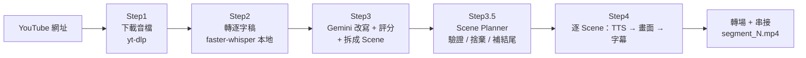

# Lean Video Pipeline

把一支財經 YouTube 影片，自動改寫成多支 **9:16 直式短影音**（1080×1920）。
全程使用免費工具與免費額度，沒有任何付費 API。

> **設計理念：Gemini 是導演，Python 是攝影棚。**
> Gemini 只決定「內容怎麼拆、每段用哪種畫面、講什麼、有哪些數據」；
> 動畫、轉場、字幕、時間軸全部由 Python 負責，而且每個畫面的時長**以 TTS 實際語音長度為準**，
> 不讓 Gemini 估秒數。

---

## 目錄

- [流程](#流程)
- [Scene 系統](#scene-系統)
- [快速開始](#快速開始)
- [設定參數](#設定參數)
- [快取與重跑](#快取與重跑)
- [專案結構](#專案結構)
- [開發指南](#開發指南)
- [疑難排解](#疑難排解)
- [成本](#成本)
- [隱私與版權](#隱私與版權)
- [已知限制](#已知限制)

---

## 流程



| 步驟 | 內容 | 工具 | 程式 |
|---|---|---|---|
| Step1 | 只下載音軌並轉 mp3 | yt-dlp | `download.py` |
| Step2 | 音檔轉逐字稿（超過長度門檻先濾靜音） | faster-whisper（本地 CPU） | `transcribe.py` |
| Step3 | 一次呼叫：切分主題、評分、改寫、拆成 Scene | Google Gemini API | `rewrite.py` |
| Step3.5 | 驗證每個 Scene，不合法就捨棄，缺結尾就補 | 純 Python | `scene_planner.py` |
| Step4 | 逐 Scene 配音 → 繪製畫面 → 疊字幕 → 轉場 → 輸出影片 | edge-tts + PIL/numpy + moviepy | `render.py` 與 `scenes/` |

四個步驟由 `src/pipeline.py` 串接，從網址到影片檔全自動，中間沒有人工步驟。

---

## Scene 系統

Gemini 把每個主題段落拆成一串 **Scene**。每個 Scene 是一個「有意義的資訊單位」，
而不是每隔幾秒就換一次畫面。目前支援 8 種：

| type | 用途 | 必要欄位 | 驗證規則 |
|---|---|---|---|
| `hook` | 開場吸睛句 | `narration` | narration 不可為空 |
| `big_number` | 單一關鍵數字 | `narration`、`value`（選填 `unit`、`label`） | value 不可為空 |
| `ranking` | 排名 | `narration`、`data: [{label, value}]` | **至少 3 筆**，value 為數字 |
| `trend` | 隨時間的變化 | `narration`、`data: [{label, value}]` | **至少 3 筆**，value 為數字 |
| `comparison` | A vs B | `narration`、`data: [{label, value}]` | **剛好 2 筆**，value 為數字 |
| `quote` | 純文字重點句 | `narration` | narration 不可為空 |
| `timeline` | 事件時間軸 | `narration`、`data: [{time, event}]` | **至少 3 筆**，time / event 皆不可為空 |
| `ending` | 收尾 | `narration` | 沒有時自動補固定收尾句 |

- `narration` 是觀眾**聽到**的旁白（送去 TTS）；`value` / `data` 是觀眾**看到**的內容。
- `visual_note`（選填）是 Gemini 給畫面的建議，目前只保留在資料中，renderer 不使用。
- 2 筆資料用 `comparison`、3 筆以上有排序意義用 `ranking`、3 筆以上呈現時間變化用 `trend`，
  筆數規則是刻意設計，不會被自動放寬。

### Scene Planner（Step3.5）做什麼

1. 逐一驗證每個 Scene；缺必要欄位、type 不合法、筆數不符 → **捨棄**（不會補預設值，避免畫面看起來正常但數據是假的）
2. 每個捨棄都會印 log，包含原本的 type、原順位與原因
3. 過濾之後才**重新編號**（`scene_01`、`scene_02`…）
4. 沒有 `ending` 就補一個固定的中性收尾句

```
[ScenePlanner] segment='台北買房到底有多難' 捨棄 scene（原type=big_number, 原順位=2）：big_number 缺少必要欄位 value
[ScenePlanner] segment='台北買房到底有多難' 未包含ending，補上fallback收尾
[ScenePlanner] segment='台北買房到底有多難' 最終保留 3 個Scene：hook, trend, ending
```

### 每種 Scene 的畫面

風格統一：深色底（`#141826`）、白色主文字、青色強調（`#4FD1C5`），為手機觀看設計
（大字、安全邊界、避免密集圖表）。動畫只在幫助理解資訊時使用。

| Scene | 畫面 |
|---|---|
| `hook` | 背景柔光浮現 → 旁白依標點切成兩段依序淡入（第二段用青色）→ 放大脈衝 → 定格 |
| `big_number` | label 淡入 → 數字由 0 緩出 Count Up、短進度條同步填滿 → 放大脈衝 → 定格 |
| `ranking` | 名次 + 名稱 + 數值 + 依數值長度的長條，第 1 名青色，依序由上往下出現 |
| `trend` | 折線由左畫到右、每點標數值；畫完後顯示 ↑↓、差值、百分比（由資料直接算出） |
| `comparison` | 左右兩根直條，較大者青色；上方顯示差距與倍數（由兩個數值直接算出） |
| `quote` | 靠左的 editorial 版面：青色引號 + 大字白色文字，只有淡入 |
| `timeline` | 垂直時間軸：節點依序出現、連線往下延伸，每個節點是時間 + 事件 |
| `ending` | 置中文字 + 青色短線，最後淡出成深色底 |

所有動畫的時間點都是「佔 Scene 時長的比例」，所以 Scene 唸 2 秒或 12 秒，節奏都會等比例縮放。

**資料不足時不猜資料**：`ranking` / `trend` / `comparison` / `timeline` 若收到不合法資料
（Scene Planner 正常會先攔截），renderer 會改成只顯示旁白的純文字卡並印出 log，
不會補數字、不會補單位、不會補標題。

### 轉場（`transitions.py`）

只有兩種情況會淡出到底色，其餘一律硬切（沒有 crossfade）：

| 邊界 | 處理 |
|---|---|
| 任何 Scene → `ending` | 前一個 Scene 淡出 0.35 秒 |
| 相同 type 的 Scene 連續出現（例如兩個 `big_number`） | 前一個 Scene 淡出 0.2 秒 |
| 其他 | 硬切 |

淡出不重疊、不改總長度、不動音訊。

### 字幕（`text_render.py`）

- 只加在資料型 Scene：`big_number`、`ranking`、`trend`、`comparison`、`timeline`
  （`hook` / `quote` / `ending` 本來就把旁白當主視覺文字，不重複加字幕）
- 字幕文字就是該 Scene 的 `narration`，不需要額外欄位
- 旁白依標點切成一句一句，每句最多 2 行，位於底部安全區
- **關鍵字用青色標示**（只改顏色，不改字級，所以不會造成文字跳動）：
  數字與單位（`11.3 倍`、`8%`、`一萬五千元`、`六成`、`七、八十萬`）以及少數變化詞（`翻倍`、`飆漲`、`突破`…）；
  同一句最多標 2 處，數字優先
- 每句顯示時間依「標點停頓 + 字數比例」估計，**不是**逐字對齊語音時間戳記

---

## 快速開始

### 1. 事前準備

- **Python 3.12**（建議；3.10+ 應可行）
- **ffmpeg**（含 ffprobe）。Windows 建議用 winget，會自動設定環境變數：

  ```cmd
  winget install "FFmpeg (Essentials Build)"
  ```

  安裝後**重新開一個終端機視窗**，執行 `ffmpeg -version` 確認。
  macOS / Linux：`brew install ffmpeg` / `apt install ffmpeg`。
- **網路連線**：下載影片、呼叫 Gemini、edge-tts 語音都需要連網（轉錄與影片渲染在本機執行）

### 2. 建立虛擬環境並安裝套件

```cmd
python -m venv .venv
.venv\Scripts\activate
pip install -r requirements.txt
```

macOS / Linux 啟用虛擬環境改用 `source .venv/bin/activate`。
主要套件：yt-dlp、faster-whisper、google-generativeai、edge-tts、moviepy（**需 2.x**）、
Pillow、matplotlib、python-dotenv。

### 3. 申請 Gemini API Key

轉錄使用本地 faster-whisper，不需要 key；只有 Step3 改寫需要一支 Gemini API Key：

1. 前往 [Google AI Studio](https://aistudio.google.com/apikey)
2. 使用 Google 帳號登入並建立 API Key
3. 複製 key

額度與使用條件以 Google 官方頁面為準（見[成本](#成本)與[隱私與版權](#隱私與版權)）。

### 4. 設定環境變數

```cmd
copy .env.example .env
```

打開 `.env`，把 `GOOGLE_API_KEY=your_google_api_key_here` 換成你的 key，
並把 `SOURCE_VIDEO_URL` 改成要處理的 YouTube 網址。**`.env` 已列在 `.gitignore`，不會被推上 GitHub。**

### 5. 執行

```cmd
cd src
python pipeline.py
```

輸出位置：`data/cache/{video_id}/segment_0.mp4`、`segment_1.mp4`…
（支數由 Step3 的評分篩選決定，上限為 `MAX_SEGMENTS_TO_GENERATE`）。

**首次執行注意：**

- Step2 第一次會自動下載 Whisper 模型（`base` 約 140 MB）
- **Windows**：若下載模型時出現 `WinError 1314`（沒有建立符號連結的權限），
  程式已在 `transcribe.py` 開頭設定 `HF_HUB_DISABLE_SYMLINKS=1` 處理；仍遇到請確認該行存在
- 影片渲染是 CPU 運算，會比影片長度慢（見 [cost.md](./cost.md)）


### （選用）Windows 快速執行

專案根目錄提供 `run.bat`，雙擊執行會提示輸入 YouTube 網址（直接按 Enter 則沿用
`.env` 現有設定），自動更新 `.env` 並跑完整流程，適合快速切換不同影片測試。
---

## 設定參數

在 `.env` 設定，預設值定義於 `src/config.py`：

| 變數 | 預設 | 說明 |
|---|---|---|
| `GOOGLE_API_KEY` | （必填） | Gemini API Key |
| `SOURCE_VIDEO_URL` | （必填） | 要處理的 YouTube 網址 |
| `MAX_AUDIO_MINUTES` | `15` | 音檔超過幾分鐘就先用 ffmpeg 濾掉靜音再轉錄 |
| `MAX_SEGMENTS_TO_GENERATE` | `3` | 評分後最多產出幾支短影音 |
| `WHISPER_MODEL_SIZE` | `base` | faster-whisper 模型大小（越大越準、越慢） |
| `GEMINI_MODEL` | `gemini-3.5-flash-lite` | 改寫使用的 Gemini 模型（`gemini-2.5-flash-lite` 已於近期對新用戶下架） |

---

## 快取與重跑

以 YouTube `video_id` 為 key，每支影片的中間產物都存在 `data/cache/{video_id}/`。
每個步驟執行前會先檢查輸出是否存在，存在就印「命中快取，跳過」。

| 檔案 | 產生者 | 說明 |
|---|---|---|
| `audio.mp3` / `audio_trimmed.mp3` | Step1 / Step2 | 原音檔 / 濾靜音後的音檔（僅超過長度門檻時產生） |
| `transcript.json` | Step2 | 逐字稿與時間戳記 |
| `script_candidates.json` | Step3 | Gemini 回傳的所有候選段落（原始輸出） |
| `selected_scripts.json` | Step3 | 評分後入選的段落 |
| `segment_{i}_scene_{NN}_audio.mp3` | Step4 | 每個 Scene 的語音 |
| `segment_{i}.mp4` | Step4 | 最終短影音 |

**想強制重跑某個步驟，刪掉對應檔案即可：**

| 想做什麼 | 刪除 |
|---|---|
| 只重新渲染影片（改了 Scene 程式、轉場或字幕） | `segment_{i}.mp4` |
| 重新讓 Gemini 改寫 | `script_candidates.json` 與 `selected_scripts.json` |
| 重新配音 | 對應的 `segment_{i}_scene_{NN}_audio.mp3` |

> **注意**：語音檔以「段落編號 + Scene 編號」命名。重新讓 Gemini 改寫之後腳本內容會不同，
> 但檔名可能相同，舊語音會被誤用——重新改寫時請**一併刪除** `segment_*_scene_*_audio.mp3` 與 `segment_*.mp4`。
> Scene Planner（Step3.5）每次執行都會重跑，不寫入快取。

---

## 專案結構

```
├── src/
│   ├── pipeline.py        # 主流程入口，串接 Step1 ~ Step4
│   ├── config.py          # 讀取 .env
│   ├── cache.py           # 快取機制（路徑、讀寫 JSON、log）
│   ├── download.py        # Step1：下載音檔
│   ├── transcribe.py      # Step2：本地轉錄
│   ├── rewrite.py         # Step3：Gemini 改寫 + 評分 + 拆 Scene（Prompt 在這裡）
│   ├── scene_planner.py   # Step3.5：Scene 驗證 / 捨棄 / 重新編號 / 補結尾
│   ├── tts.py             # edge-tts 語音；以實際音檔長度作為 Scene 時長
│   ├── render.py          # Step4：Scene orchestrator（配音、畫面、字幕、轉場、輸出）
│   ├── transitions.py     # 轉場規則（淡出 / 硬切）
│   ├── text_render.py     # 字幕（含關鍵字標示）
│   └── scenes/
│       ├── base.py        # 畫布尺寸、配色、字型、動畫用的數學函式
│       ├── hook.py  big_number.py  ranking.py  trend.py
│       └── comparison.py  quote.py  timeline.py  ending.py
├── data/
│   └── cache/             # 各步驟輸出，依 video_id 分資料夾（已加入 .gitignore）
├── .env.example
├── requirements.txt
├── README.md
└── cost.md                # 成本說明
```

> `src/charts.py`，以及 `text_render.py` 裡的 `render_title_image` / `render_subtitle_image`，
> 是 Scene 系統之前的舊版畫面程式，**目前的流程不再使用**。
> `data/output/` 目前是空的保留資料夾，最終影片實際輸出在 `data/cache/{video_id}/`。

---

## 開發指南

### 新增一種 Scene

1. 在 `src/scenes/` 新增 `xxx.py`，提供 `render_xxx_scene(video_id, segment_index, scene, duration)`，
   回傳 moviepy 的 `VideoClip`（長度必須等於 `duration`）
2. 在 `render.py` 的 `SUPPORTED_SCENE_RENDERERS` 登記
3. 在 `scene_planner.py` 加上該 type 的驗證規則
4. 在 `rewrite.py` 的 Prompt 說明新 type 與欄位

### 不用跑完整流程，直接預覽某個 Scene 的畫面

在 `src/` 底下執行：

```python
from PIL import Image
from scenes.trend import render_trend_scene

scene = {"id": "scene_02", "type": "trend", "narration": "示範",
         "data": [{"label": "2023", "value": 9.2},
                  {"label": "2024", "value": 10.1},
                  {"label": "2025", "value": 11.3}]}
clip = render_trend_scene("demo", 0, scene, duration=6.0)
Image.fromarray(clip.get_frame(4.0)).save("preview.png")   # 取第 4 秒的畫面
```

`get_frame(t)` 不會寫任何檔案，可以用不同的 `t` 檢查動畫的各個階段。

---

## 疑難排解

| 現象 | 原因與處理 |
|---|---|
| 改了程式但影片沒變 | `segment_{i}.mp4` 已存在而命中快取，刪掉重跑 |
| `找不到 ffmpeg / ffprobe` | 安裝 ffmpeg 後**重開終端機**，用 `ffmpeg -version` 確認 |
| 畫面上的中文變成方塊 | 找不到中文字型。字型清單在 `scenes/base.py` 的 `FONT_FAMILY`（預設為 Windows 的微軟正黑體），macOS / Linux 請改成系統有的中文字型 |
| Gemini 回傳 JSON 解析失敗 | 程式會印出原始回傳內容供除錯；LLM 輸出有隨機性，刪掉 `script_candidates.json` 重跑通常可解決 |
| 某個 Scene 沒出現在影片 | 看 `[ScenePlanner]` 的 log，通常是資料不合法被捨棄（例如 `ranking` 只有 2 筆） |
| 語音生成失敗 | edge-tts 需要連網；檢查網路後重跑（已完成的語音會命中快取） |
| `WinError 1314` | 見上方「首次執行注意」 |

---

## 成本

全程使用免費工具與免費額度，現金花費為 **$0**；但仍有時間、算力、網路與隱私上的成本。
完整說明與實測數據見 [cost.md](./cost.md)。

---

## 隱私與版權

**隱私**

- Step3 會把**完整逐字稿**送到 Google Gemini API。依 Google 官方定價頁，免費層級的內容
  「可能被用來改進 Google 產品」（查詢日期見 [cost.md](./cost.md)）——**請勿處理含機密或個資的內容**
- Step4 的旁白文字會送到 edge-tts（微軟 Edge 的線上語音服務）合成語音
- API Key 只存在本機 `.env`，該檔已被 `.gitignore` 排除

**版權**

- 本專案是技術工具，**不提供任何法律意見**。處理的影片是否可被改寫、重製或發布，
  請自行確認來源的授權條件
- 改寫階段的 Prompt 要求「不可逐字照抄原文、句子結構與用詞需明顯不同」以及
  「Scene 中的數字必須是逐字稿中實際提到的真實數字，不可虛構」。這是**對 LLM 的指示，不是程式保證**，
  發布前請人工核對，可對照 `transcript.json`（原逐字稿）與 `selected_scripts.json`（改寫後）
- **實測中曾出現具體案例**：Gemini 曾把逐字稿中「三萬兩千元」誤植為「三十二萬元」（相差10倍），
  這類數字換算錯誤是 LLM 改寫類任務的已知風險，凸顯上述人工核對步驟並非流於形式的建議
- Gemini 會產出 `source_note`（出處標示句）並存進 `selected_scripts.json`，
  但**目前不會自動顯示在影片畫面中**。發布時請自行在影片說明或畫面中標示出處
- 畫面全部由程式繪製，沒有使用任何截圖或外部素材

---

## 已知限制

- **字幕時間是估計值**：依標點與字數比例分配，不是逐字對齊語音，每句可能有零點幾秒的偏差
- **字幕與畫面可能重疊**：字幕固定在畫面底部；`ranking` 筆數很多（8 筆）或 `timeline` 內容很滿時，
  主畫面可能延伸到字幕區
- **資料量上限**：`ranking`、`timeline` 超過 8 筆只顯示前 8 筆（會印 log），手機上再多就看不清
- **Scene 內沒有單位與標題欄位**：`ranking` / `trend` / `comparison` 的數值以原樣顯示、不加單位，
  單位靠旁白說明
- **Keyword 標示是本地規則**：只涵蓋常見的數字、單位與少數變化詞，不是自然語言理解
- **Whisper `base` 模型有錯字**：例如「新青安」可能被辨識成其他字，可改用更大的模型
- **LLM 輸出有隨機性**：同一份逐字稿多次改寫，切出的段落數與 Scene 組合可能不同
- **`google.generativeai` 套件已被官方標示為 deprecated**：功能目前不受影響，日後建議遷移到新版 `google.genai`
- **主要在 Windows 驗證**：字型與路徑處理以 Windows 為主，其他系統可能需要調整字型設定
- **渲染速度**：影片由 CPU 逐幀合成，渲染時間約為影片長度的 2～3 倍（作者機器上的實測值）
- 未整合外部 AI 影片生成或 Avatar 服務：這類服務多數沒有真正免費的方案，與本專案「不產生現金花費」的目標不符

---

_最後更新：2026-09-20_
